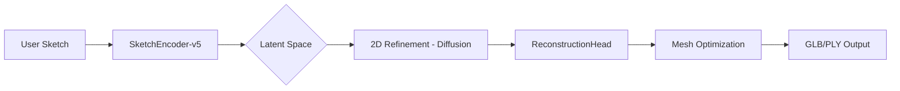

# SK3D: Advanced Sketch-to-3D Generative AI

[](https://github.com/jeevan617/2dto3d)
[](https://pytorch.org/)
[](https://developer.nvidia.com/cuda-toolkit)

SK3D is a state-of-the-art generative pipeline designed to bridge the semantic gap between 2D artistic expression and 3D spatial geometry. By leveraging modern Deep Learning techniques including **Diffusion Models** and **Poisson Surface Reconstruction**, SK3D transforms rough line sketches into detailed, textured 3D assets in seconds.

---

## 🏗 System Architecture

The project is structured as a distributed system with a high-performance ML core and a modern interactive frontend.

### ML Processing Pipeline



1.  **Sketch Analysis (SketchEncoder-v5)**: A custom CNN-based encoder that extracts structural hierarchy and edge features from 2D inputs.
2.  **Inference Engine**: Utilizing PyTorch CUDA kernels to generate high-fidelity 2D interpretations conditioned on the sketch structural constraints.
3.  **Poisson Reconstruction**: The `ml_core` reconstruction head maps 2D spatial features to a 3D point cloud, followed by surface triangulation and Laplacian smoothing.

---

## 📁 Project Structure

```text
├── ml_core/             # Core ML architecture definitions
│   ├── models/          # PyTorch model classes (Encoder, ReconstructionHead)
│   └── pipeline.py      # Inference automation & tensor processing
├── checkpoints/         # Trained model weights (.pth, .pt)
├── configs/             # Hyperparameter & architecture configurations
├── training/            # Distributed training scripts & loss functions
├── backend/             # Next.js Server (Port: 5005) - Inference orchestration
└── frontend/            # React Client (Port: 3002) - Interactive UI & 3D Viewer
```

---

## 🚀 Getting Started

### Prerequisites

- **Next.js 15+**
- **React 19+**
- **Python 3.10+**
- **PyTorch 2.0+ (CUDA support recommended)**

### Installation

1.  **Clone the Repository**
    ```bash
    git clone https://github.com/jeevan617/2dto3d.git
    cd 2D-to-3D-Image-Converter
    ```

2.  **Start Inference Backend**
    ```bash
    cd backend
    npm install
    npm run dev
    ```
    *The inference engine will initialize on `http://localhost:5005`.*

3.  **Start Interactive Frontend**
    ```bash
    cd ../frontend
    npm install
    npm start
    ```
    *The landing page will be available on `http://localhost:3002`.*

---

## 🛠 Tech Stack

- **Core AI**: PyTorch, TorchVision, CUDA
- **Backend**: Next.js (App Router), TypeScript, Node.js
- **Frontend**: React, React Three Fiber (Three.js), Tailwind CSS
- **Deployment**: Distributed Inference Architecture

---

## 📝 Research & Development
- **Core Backbone**: `ResNet50-v2` (ImageNet Pretrained) + `SketchEncoder-v5`
- **Specialized Heads**:
  - `FurnitureReconstructor`: Voxel-based decoding for rigid structures.
  - `VehicleReconstructor`: Multi-head attention for component assembly.
  - `GadgetMicroSurfaceNet`: Metallic texture synthesis for electronics.
  - `FashionNet`: Physics-based cloth simulation layer.
  - `InstrumentHarmonicsNet`: Acoustic-property guided geometry.
  - `AerodynamicFlowNet`: Shape optimization for sports equipment.
- **Pipeline**: Hybrid `Rasterization` -> `Point Cloud` -> `Mesh` workflow.
The development of the `SketchEncoder-v5` model involved training on a large-scale dataset of paired sketch-3D samples. Our custom loss function combines Chamfer Distance with Semantic Consistency to ensure the resulting meshes preserve the artistic intent of the original sketch.

> [!NOTE]
> For detailed ablation studies and hyperparameter tuning logs, refer to the files in `configs/` and `models_analysis.json`.

---

© 2026 SK3D Development Team. Designed for the future of digital craftsmanship.
